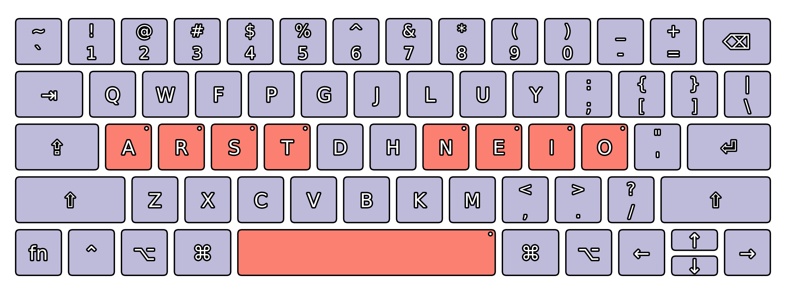
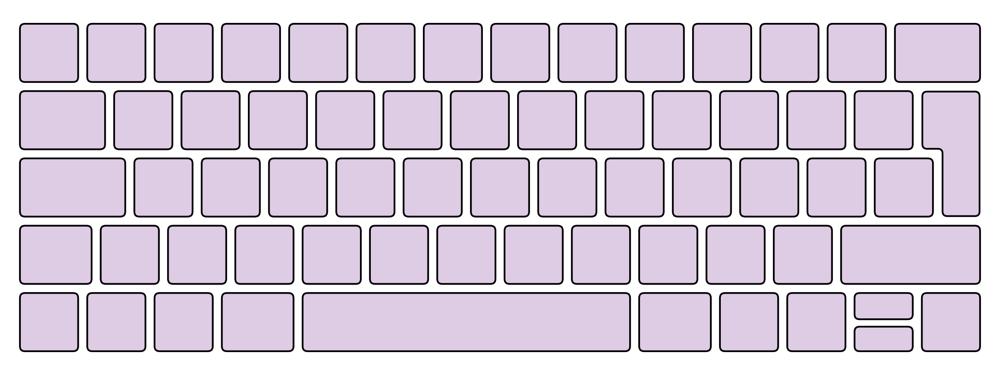
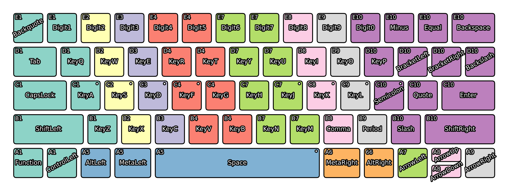

# KeyboardQuestion
Analysis of keyboard effectivenes. This app used to compute layout metrics. There's many of them.

> [!NOTE]  
> Backend is located in [separate repository](https://github.com/Catalyst-42/keyboard-question-backend)

> [!NOTE]  
> Frontend is located in [separate repository](https://github.com/Catalyst-42/keyboard-question-frontend)

## Images
Analyzer also can create images of keyboard in many different ways. Here' some examples of them.

|  |  |
|-|-|
|  |  |

## Setup
To use project, install Python, and add requirements. 

```
pip install -r requirements.txt
```

You now can search for `.yaml` files to see settings
for scripts of app. All used models are located in `data` folder.

## Launch
Try to run random files in src folder and see, what they does. Also check settings, here you can set your own styles of displaying of data.

If you want to create own custom layout or keyboard and check them, move by this steps:

Stages of getting metrics:
- Create physical keyboard
  - Define physical keys, it's position on free canvas
- Create layout
  - Create mapping for physical keys
- Get bigramms list
  - Define corpus
  - Find large amount of test text
  - Calculate bigramms
- Compute metrics

### Terms
##### Key
Means physical key code. Prefer to use key codes, described in [W3C](https://developer.mozilla.org/en-US/docs/Web/API/KeyboardEvent/keyCode#constants_for_keycode_value)

##### Mapping
Representation of pressed key.
For example, basic `KeyS` pressed on standard qwerty layout will give the `s` mapping.
But on jcuken it will give the `ы` mapping. 

##### Layout
The joints between physical keys and it's mappings.

##### Keyboard
Describes the position of physical keys, it's physical parameters.

### Keyboard profile
Keyboard layout describes list of available
physical keys with their location and sizes on canvas.

Canvas: 

```
0    x -->

y   x.y---w-.
|    |      |
v    h      |
     '------'
```

### Layout
Here' some drafts that I dont wanna to delete, so just enjoy. Here the example of keyboard layout mappings, suggested to display instead of an image of visualizer.

```
`~ 1! 2@ 3# 4$ 5% 6^ 7& 8* 9( 0) -_ =+
   qQ wW eE rR tT yY uU iI oO pP [{ ]} \|
   aA sS dD fF gG hH jJ kK lL ;: '"
   zZ xX cC vV bB nN mM ,< .> /?
```

And each layers.

```
` 1 2 3 4 5 6 7 8 9 0 - =
  q w e r t y u i o p [ ] \
  a s d f g h j k l ; '
  z x c v b n m , . /

~ ! @ # $ % ^ & * ( ) _ +
  Q W E R T Y U I O P { } |
  A S D F G H J K L : "
  Z X C V B N M < > ? 
```

### Keys by fingers
We accord numbers to fingers starging from pinky on left hand and ending with pinky on right hand. We start counting from 1 to 10.

```
   _.-._                _.-._
 _|2|3|4|              |7|8|9|_
|1| | | |              | | | 10|
| | | | |  _        _  | | | | |
| '     |/5/        \6\|     ' |
|       / /          \ \       |
 \       /            \       /
  |     |              |     |
```

Also here's the mockup of finger usage and row usage.

```

         Usage of fingers           Usage of rows

 ╭╴00.00%              00.00%╶╮       1 00.00%
 │ ╭╴00.00%          00.00%╶╮ │       2 00.00%
 1 2 3 4                7 8 9 10      3 00.00%
     │ ╰╴00.00%  00.00%╶╯ │           4 00.00%
     ╰╴00.00%      00.00%╶╯           5 00.00%

 Left - 00.00%    00.00% - Right
```

<!-- TODO
- [ ] Make normal readme with examples
- [ ] Refactor api queries
- [ ] Recalculate all metrics with one unit equal 40
-->
